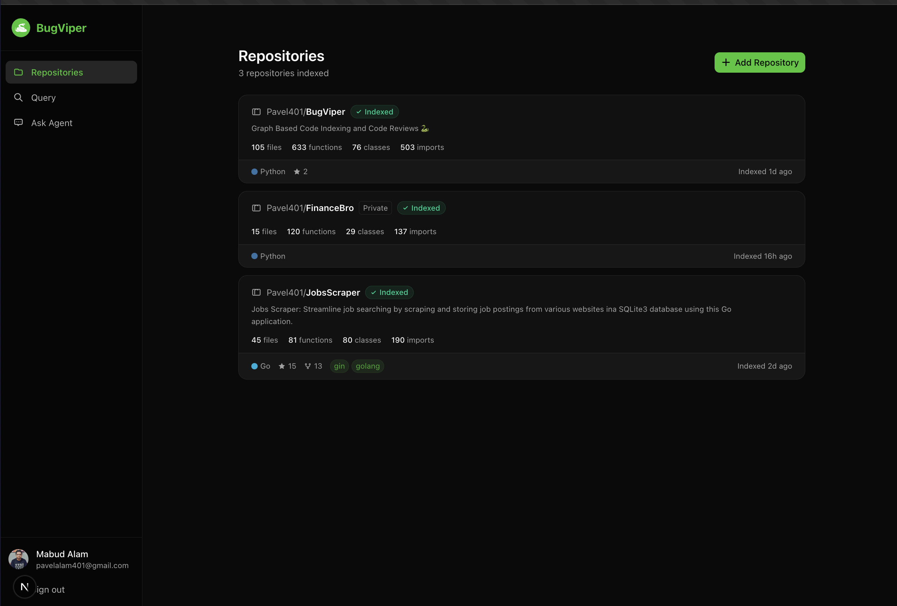
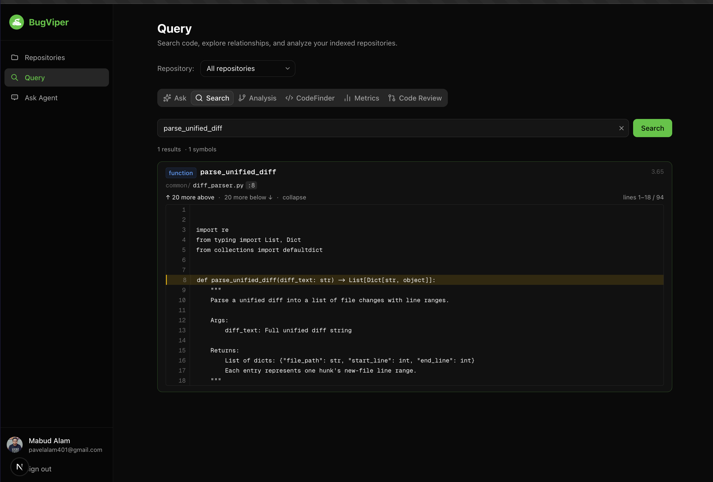
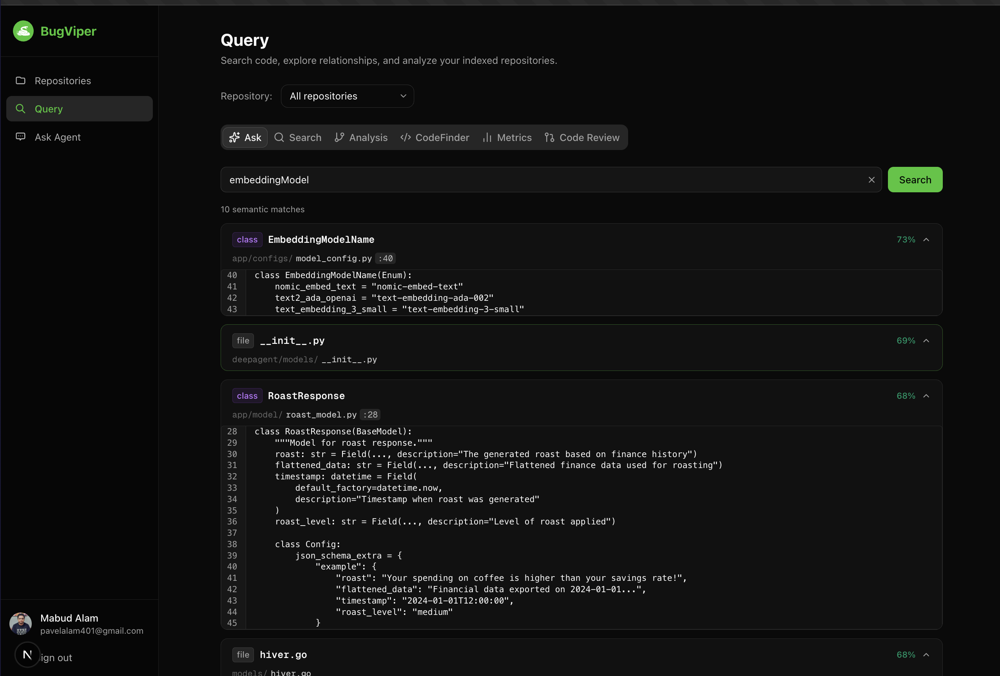
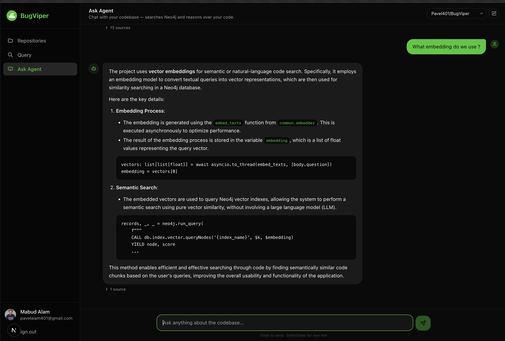
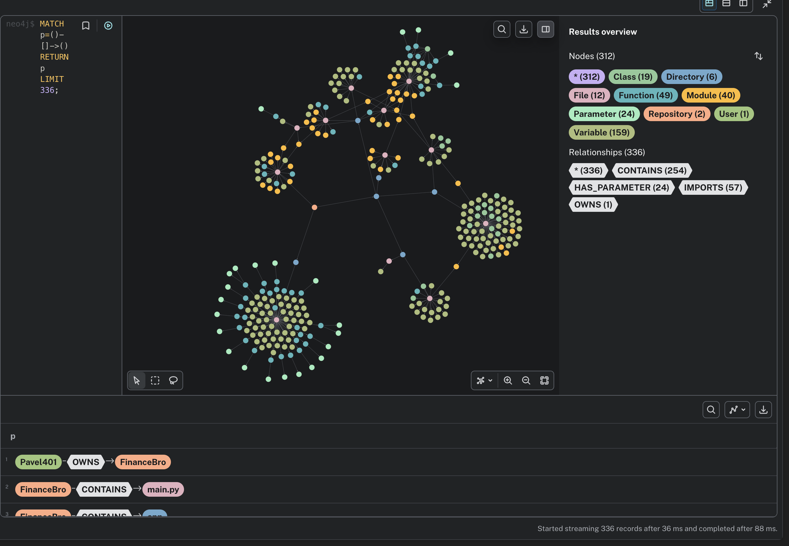
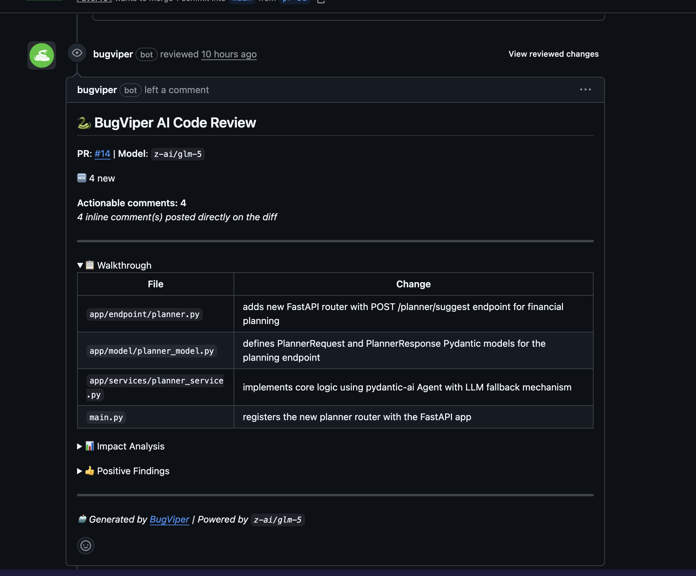
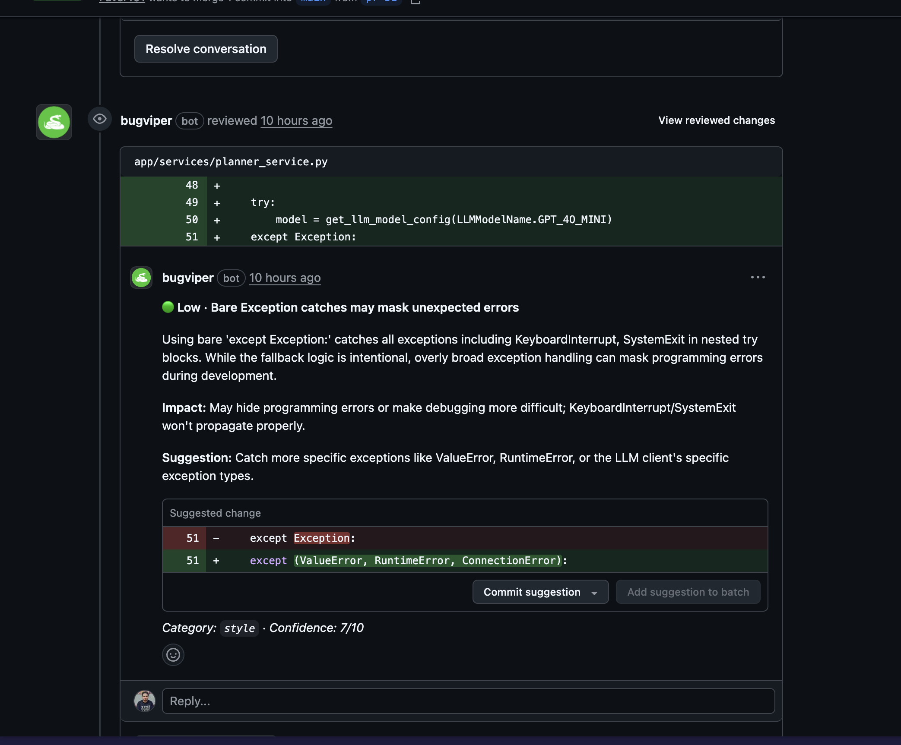
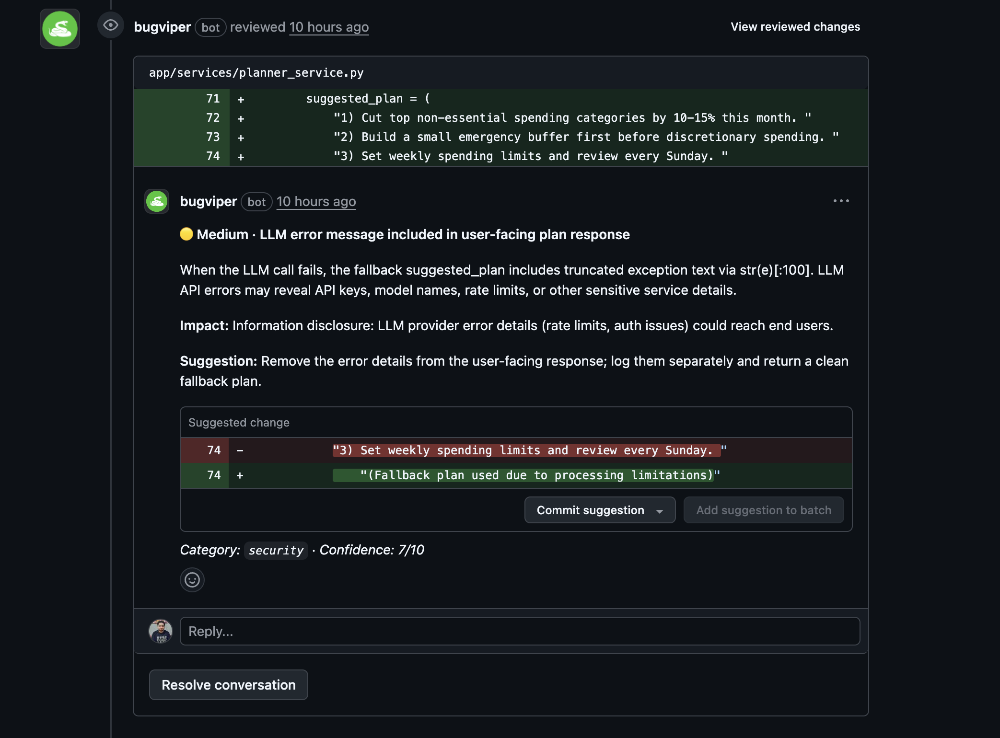

# BugViper

   

> AI-powered code review and repository intelligence platform.

BugViper ingests your repositories into a **Neo4j knowledge graph** via Tree-sitter AST parsing, then sends a **LangGraph-powered agent** to review pull requests — finding bugs, security issues, and code quality problems with full codebase context. It also ships a Query interface for full-text and semantic code search, plus an AI chat agent that reasons directly over your graph.

---

## Screenshots

### Repository Dashboard

<div align="center">

</div>

Each indexed repository shows live stats derived directly from the Neo4j graph — file count, function count, class count, and import count. Repositories are indexed once and stay up to date via GitHub push webhooks.

---

### Full-Text Code Search

<div align="center">

</div>

Search any symbol name or keyword across the entire graph. Results are anchored to the exact source line with an inline peek viewer — expand up or down to read surrounding context without leaving the page.

---

### Semantic Code Search

<div align="center">

</div>

When full-text isn't enough, semantic search embeds your query and returns results ranked by **cosine similarity** from Neo4j vector indexes. Useful for finding code by intent: *"embedding model configuration"* returns `EmbeddingModelName`, `RoastResponse`, and other conceptually related nodes at 73%, 69%, 68% similarity.

---

### Ask Agent — AI Chat Over Your Codebase

<div align="center">

</div>

The **Ask Agent** page connects a ReAct LLM to your Neo4j graph. Ask natural language questions — the agent reasons across 13+ tool calls, cites source files, and shows the relevant code inline. Ask *"What embedding do we use?"* and it finds the embedder, explains the batch flow, and shows the actual Cypher query.

---

### The Knowledge Graph

<div align="center">

</div>

BugViper materialises your codebase as a property graph — 312 nodes and 336 relationships shown here for a single repository, spanning `Function`, `Class`, `File`, `Module`, `Variable`, and `Repository` node types. Explore it directly in Neo4j Browser or query it from the API.

---

### PR Review — Summary & Walkthrough

<div align="center">

</div>

When a PR is opened the BugViper bot posts a structured top-level comment with:
- Model used and actionable comment count
- **Walkthrough table** — every changed file and a one-line summary of what changed
- **Impact Analysis** and **Positive Findings** sections

---

### PR Review — Inline Bug Comment

<div align="center">

</div>

Each issue is posted as an **inline diff comment** pinned to the exact line. Here the agent flagged a bare `except Exception:` that catches `KeyboardInterrupt` and `SystemExit` — severity **Low**, confidence **7/10** — and suggested a specific fix with a one-line code change you can commit directly from GitHub.

---

### PR Review — Inline Security Comment

<div align="center">

</div>

The same review run caught a **Medium security** issue: LLM error details (rate limits, model names, API keys) leaking into a user-facing response via `str(e)[:100]`. The agent suggested logging the error server-side and returning a clean fallback message, preventing accidental information disclosure.

---

## How It Works

### 1. Ingestion — Building the Knowledge Graph

When you add a repository, BugViper:

1. Clones or downloads the repo
2. Runs **Tree-sitter** parsers (17 languages) to produce ASTs
3. Extracts `Function`, `Class`, `Variable`, `File`, `Module`, `Repository` nodes
4. Writes the graph to **Neo4j** with relationships: `CONTAINS`, `DEFINES`, `CALLS`, `IMPORTS`, `INHERITS`
5. Calculates **cyclomatic complexity** at parse time for every function
6. Optionally batch-embeds all nodes with `text-embedding-3-small` → stores vectors in Neo4j vector indexes

```
    GitHub 
       │
       ▼
  Tree-sitter AST (17 languages)
       │
  Graph Builder ─────────► Neo4j  (nodes + relationships)
       │
  Embedder (optional) ────► Neo4j  (vector indexes: 1536-dim cosine)
```

---

### 2. Full-Text Search — Apache Lucene inside Neo4j

Neo4j's full-text search is backed by **Apache Lucene** — the same engine that powers Elasticsearch. BugViper creates two Lucene indexes at setup time:

| Index | Node types | Fields |
|---|---|---|
| `code_search` | `Function`, `Class`, `Variable` | `name`, `docstring`, `source_code` |
| `file_content_search` | `File` | `source_code` |

**Two-tier search strategy** (`db/queries.py → search_code()`):

```
User query
    │
    ├─► Tier 1 — `code_search` Lucene index
    │       Simple identifiers  →  phrase search   "parse_unified_diff"
    │       Special characters  →  AND-keywords    token1 AND token2
    │
    └─► Tier 2 — fallback to `file_content_search`  (if Tier 1 empty)
            Searches raw file content line-by-line
            Returns: path + line_number + matching line  (no full source dump)
```

Searching `parse_unified_diff` hits the function node instantly by name. Searching `"Authorization: Bearer"` falls through to line-level file content search. Both paths return lean results; the **Peek API** (`/code-finder/peek`) then fetches a windowed view around any line on demand, keeping responses fast regardless of file size.

Lucene escaping is applied automatically: clean identifiers get phrase-quoted, anything with special characters is tokenised and joined with `AND`.

---

### 3. The PR Review Agent — How It Finds Issues

The review pipeline is a **two-phase LangGraph graph** (`code_review_agent/agent/`):

```
PR opened / comment trigger
          │
          ▼
   Build diff + context prompt
          │
  ┌───────▼────────────────────┐
  │  Phase 1 — ReAct Explorer  │
  │  LangGraph StateGraph       │  LLM + 19 Neo4j tools
  │  MAX_TOOL_ROUNDS = 6        │  Stops deterministically
  └───────────┬────────────────┘
              │  accumulated messages (diff + tool results)
              ▼
  ┌───────────▼────────────────┐
  │  Phase 2 — Synthesizer     │
  │  Plain LLM call            │  JSON schema embedded in prompt
  │  Works on any OpenRouter   │  Robust JSON extraction (fence/prose/raw)
  │  model                     │
  └───────────┬────────────────┘
              │
    Confidence filter  ≥ 7 / 10
              │
              ▼
   Post inline GitHub comments
```

**Phase 1 — ReAct Exploration**

The agent receives the PR diff and iteratively calls tools against Neo4j to build context for the code under review. It is capped at **6 tool rounds** using a `tool_rounds` counter in `ReviewExplorerState` — no reliance on LangGraph's recursion limit, so accumulated messages are always returned cleanly.

The agent has **19 tools**:

| # | Tool | What it queries in Neo4j |
|---|---|---|
| 1 | `search_code` | Lucene full-text across Function / Class / Variable / File |
| 2 | `peek_code` | Line window from a file stored in the graph |
| 3 | `semantic_search` | Vector similarity search (embeddings) |
| 4 | `find_function` | Function node by exact or fuzzy name |
| 5 | `find_class` | Class node by exact or fuzzy name |
| 6 | `find_variable` | Variable by substring |
| 7 | `find_by_content` | Symbol bodies containing a pattern |
| 8 | `find_by_line` | Raw file content line-by-line |
| 9 | `find_module` | Module / package and which files import it |
| 10 | `find_imports` | Import statements referencing a module or alias |
| 11 | `find_method_usages` | All callers of a function |
| 12 | `find_callers` | Call chain tracing upstream |
| 13 | `get_class_hierarchy` | Inheritance tree — parents and children |
| 14 | `get_change_impact` | Blast radius: how many callers would break |
| 15 | `get_complexity` | Cyclomatic complexity for a specific function |
| 16 | `get_top_complex_functions` | Highest-risk functions in the repo |
| 17 | `get_file_source` | Full file content from the graph |
| 18 | `get_language_stats` | Per-language file / function / class counts |
| 19 | `get_repo_stats` | Overall graph statistics |

**Phase 2 — Structured Synthesis**

After exploration, a second LLM call receives all accumulated messages plus a JSON schema embedded directly in the system prompt. The response is parsed robustly — handles code fences, prose wrapping, and raw JSON — so any model on OpenRouter works without needing structured-output API support.


---


## Graph Schema

**Node types**: `Repository` · `File` · `Function` · `Class` · `Variable` · `Module`

**Relationships**:
```
(Repository)-[:CONTAINS]──►(File)
(File)-[:CONTAINS]─────────►(Function | Class | Variable)
(File)-[:IMPORTS]──────────►(Module)
(Class)-[:CONTAINS]────────►(Function)
(Class)-[:INHERITS]────────►(Class)
(Function)-[:CALLS]────────►(Function)
```

## Tech Stack

### Backend
| Component | Technology |
|---|---|
| API framework | FastAPI + Uvicorn |
| Package manager | uv |
| Database | Neo4j |
| Code parsing | Tree-sitter (17 languages) |
| AI / LLM | LangGraph + LangChain + OpenRouter |
| Embeddings | `openai/text-embedding-3-small` via OpenRouter |
| GitHub integration | PyGithub + GitHub App webhooks |
| Auth / user data | Firebase Admin SDK + Firestore |
| Observability | Logfire |

### Frontend
| Component | Technology |
|---|---|
| Framework | Next.js 16 (App Router) + React 19 |
| Language | TypeScript (strict mode) |
| Styling | TailwindCSS 4 + shadcn/ui (Radix primitives) |
| Icons | Lucide React |

---

## Project Structure

```
api/                         # FastAPI backend
├── app.py                   # Entry point, CORS, router registration
├── routers/
│   ├── ingestion.py         # POST /repository, /setup, /github
│   ├── query.py             # GET /search, /stats, /code-finder/*
│   ├── repository.py        # GET/DELETE repositories
│   └── webhook.py           # POST /onPush, /onComment, /github
└── services/
    ├── review_service.py    # PR review pipeline orchestration
    └── push_service.py      # Incremental push handling

code_review_agent/           # LangGraph PR review agent
├── agent/
│   ├── review_graph.py      # Phase 1: ReAct exploration graph
│   ├── runner.py            # Two-phase pipeline entry point
│   ├── tools.py             # 19 Neo4j query tools
│   └── prompts.py           # System prompts
└── models/
    └── agent_schemas.py     # AgentFindings, ReviewResults, Issue

db/                          # Neo4j database layer
├── client.py                # Connection management + retry
├── ingestion.py             # Graph ingestion service
├── queries.py               # CodeQueryService (search, stats, CRUD)
└── schema.py                # Constraints, Lucene indexes, CYPHER_QUERIES

ingestion/                   # Code parsing & ingestion engine
├── repo_ingestion_engine.py # Main orchestrator
├── graph_builder.py         # Graph construction from ASTs
├── code_search.py           # CodeFinder class
└── languages/               # 17 per-language Tree-sitter parsers

common/                      # Shared utilities
├── embedder.py              # Batch embedding via OpenRouter
├── diff_parser.py           # Unified diff parsing
└── bugviper_firebase_service.py

frontend/                    # Next.js 16 frontend
├── app/(protected)/
│   ├── query/               # Search + Analysis + CodeFinder + Review tabs
│   └── repositories/        # Repo management + ingestion
└── lib/
    ├── api.ts               # All fetch wrappers
    └── auth-context.tsx
```

---

## Quick Start

### Prerequisites
- Python 3.13+, `uv`
- Node.js 20+
- Neo4j (local or AuraDB)
- OpenRouter API key

### Backend

```bash
uv sync
cp .env.example .env   # fill in variables
uvicorn api.app:app --host 0.0.0.0 --port 8000 --reload
```

### Frontend

```bash
cd frontend && npm install && npm run dev   # http://localhost:3000
```

### All-in-one

```bash
./start.sh    # API + Frontend + Ngrok
```

---

## Environment Variables

```bash
# Neo4j
NEO4J_URI=bolt://localhost:7687
NEO4J_USERNAME=neo4j
NEO4J_PASSWORD=...

# LLM
OPENROUTER_API_KEY=...
REVIEW_MODEL=z-ai/glm-5        # any OpenRouter model

# GitHub App
GITHUB_APP_ID=...
GITHUB_PRIVATE_KEY_PATH=...
GITHUB_WEBHOOK_SECRET=...

# Firebase
SERVICE_FILE_LOC=path/to/service-account.json

# Optional
ENABLE_LOGFIRE=true
LOGFIRE_TOKEN=...
API_ALLOWED_ORIGINS=http://localhost:3000
INGESTION_SERVICE_URL=         # empty = local; set = Cloud Tasks
```

---


**Cyclomatic complexity** is stored on every `Function` node at ingestion time:

| Score | Risk |
|---|---|
| 1–5 | Simple |
| 6–10 | Moderate |
| 11–20 | Complex — refactor candidate |
| 20+ | High risk — bugs likely here |

---

## Key API Endpoints

| Method | Path | Description |
|---|---|---|
| POST | `/api/v1/ingest/repository` | Ingest a repository |
| POST | `/api/v1/ingest/setup` | Init DB schema + indexes |
| GET | `/api/v1/repos/` | List all repositories |
| GET | `/api/v1/query/search` | Full-text code search |
| GET | `/api/v1/query/code-finder/function` | Find function by name |
| GET | `/api/v1/query/code-finder/peek` | Peek lines around a file location |
| GET | `/api/v1/query/code-finder/complexity/top` | Most complex functions |
| POST | `/api/v1/query/diff-context` | Build RAG context for a diff |
| POST | `/api/v1/webhook/github` | GitHub App webhook dispatcher |

Full API docs: `/docs` (Swagger) and `/redoc` when the server is running.

---

## Development

```bash
# Python
black .          # format
ruff check .     # lint
mypy .           # type check
pytest           # tests
pytest --cov     # coverage

# Frontend
cd frontend && npm run lint && npm run build
```

---

## Roadmap

- [ ] Abstract review model — pluggable per-repo agent configs
- [ ] Improve incremental re-indexing on push
- [ ] Per-project CLAUDE.md / guidelines injected into review prompts
- [ ] Guardrails and output validation
- [ ] GitHub push, PR, and branch webhook coverage
- [ ] Auto-tag CLAUDE.md from ingested repo


